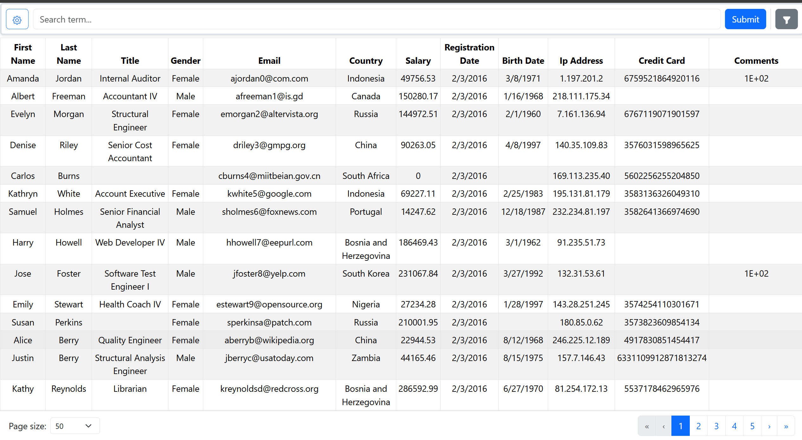
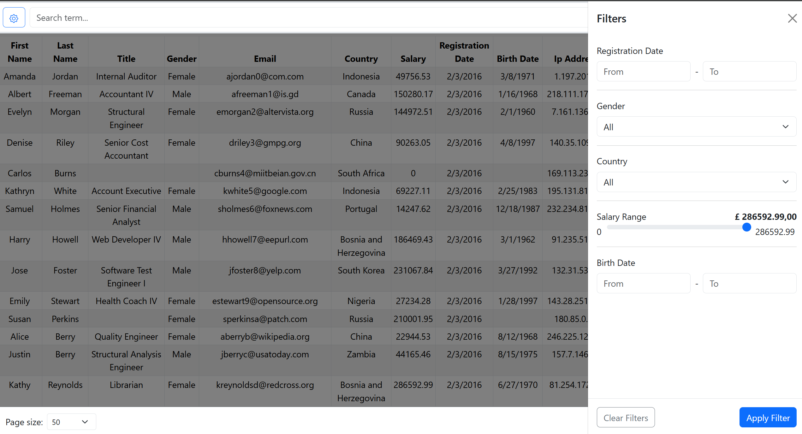
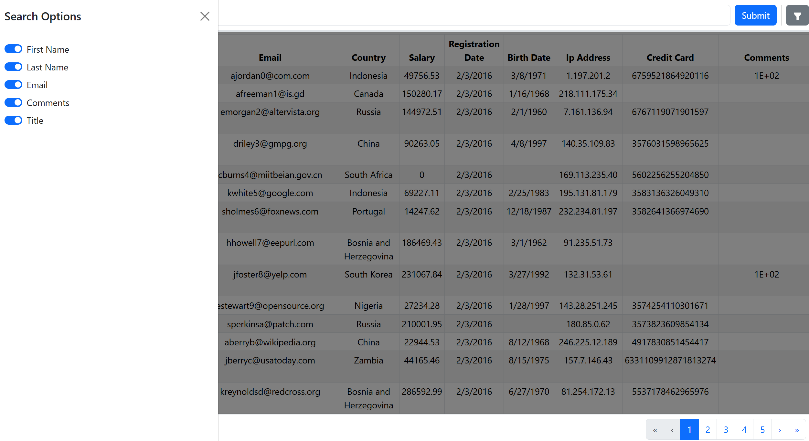
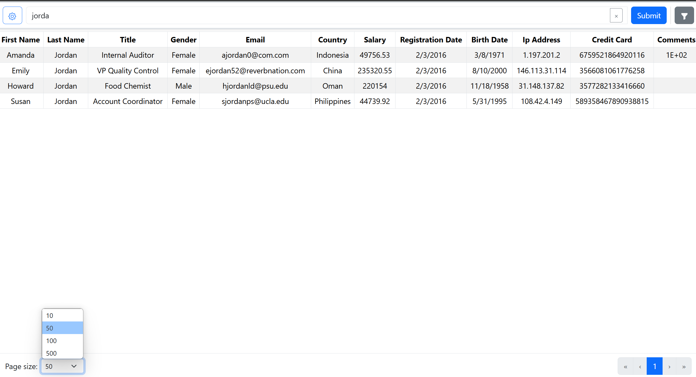
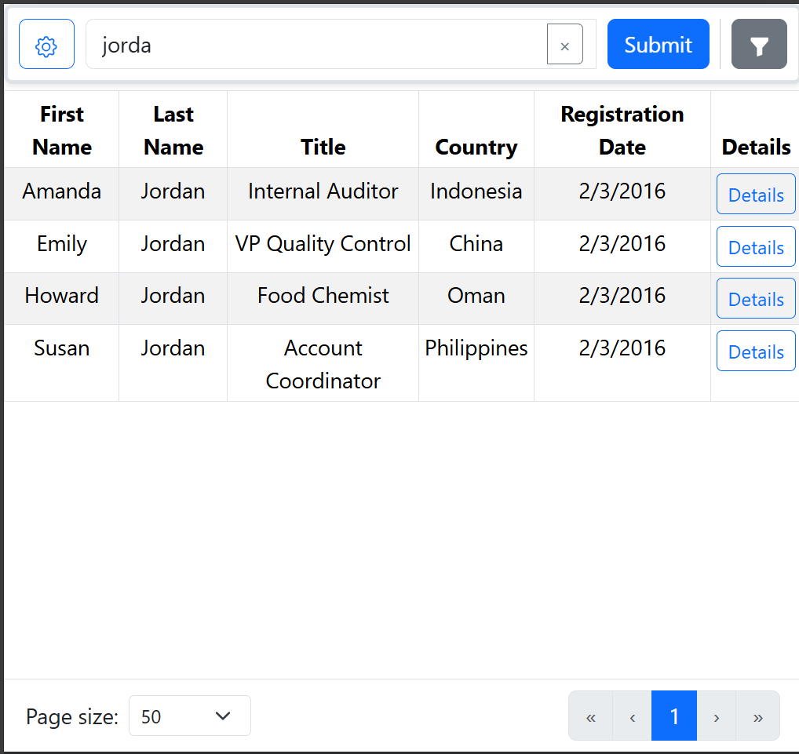
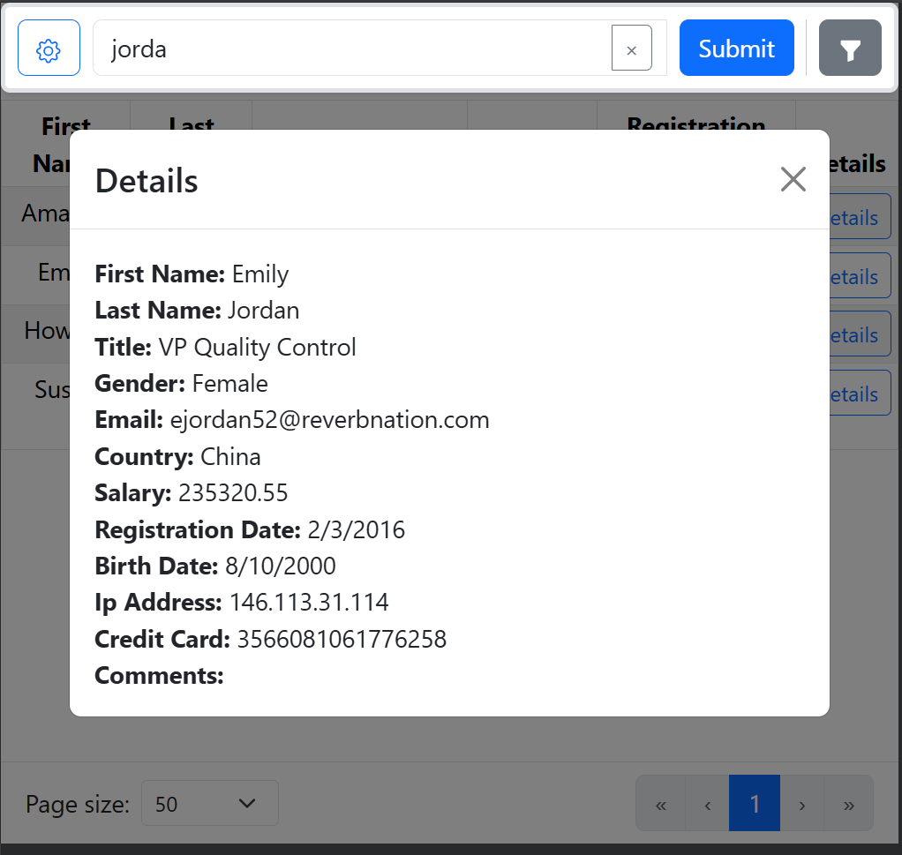

# Parquet Read Web app
A small web application that reads and displays data from a parquet file. It also allows to search and filter the data, and steps trought the pages.

## Instructions
The project is divided into two main folders: **Backend** and **Frontend**. The backend is built with .NET Core 8.0, and the solution file for Visual Studio is included inside this folder. Run this project first to start the API. 

The frontend is created with Vite React @lastest version, uses Bootstrap for display elements, and is mobile responsive. It relies on the API to function properly. Run ```npm install``` before running ```npm run dev```.

## Usage
Once the first page is loaded, you will be presented with a list of employees.


Click the 'Funnel' button to see and apply filters.


Click the 'Gear' Button to see options for using the search toolbar, e.g. which columns will be included in the search.


At the bottom, there is the pagination tool, which can be used to navigate through the records and choose the page size.


In mobile view, for smaller screens, the table will hide most of the links, and will display a new column - details, which, when clicked, will display all the details for the given row.


